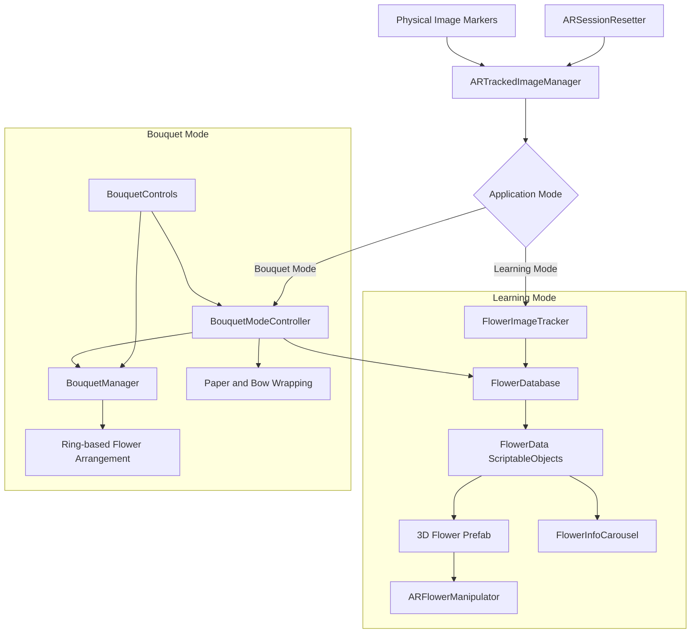

# 🌸 Bloom3D

### Educational Augmented Reality Flower Shop

Bloom3D is a mobile AR application that turns physical flower markers into interactive 3D content. Users can learn about individual flowers or combine several species and decorative wrappings into a custom virtual bouquet.

---

## Project Demo

<table align="center">
  <tr>
    <td align="center">
      <strong>Learning Mode</strong>  
      
    </td>
    <td align="center">
      <strong>Bouquet Mode</strong>  
      
    </td>
  </tr>
</table>

---

## Overview

Bloom3D was developed as a university team project for an Augmented Reality course. The application uses image tracking to connect printed markers with virtual flowers and provides two separate experiences:

- **Learning Mode** for exploring individual flowers and their care information.
- **Bouquet Mode** for building and customizing a mixed virtual bouquet.

---

## Features

### Learning Mode

- Recognizes flower markers and displays the matching 3D model.
- Shows one active flower at a time and hides it when tracking is lost.
- Supports touch-based rotation, movement, and scaling.
- Displays flower information through overview, care, and description pages.

### Bouquet Mode

- Uses a dedicated marker as the bouquet anchor.
- Combines the flower types detected by the camera into one bouquet.
- Arranges flowers procedurally in expanding circular rings.
- Allows the user to adjust flower count, spread, ring size, and height.
- Adds paper and bow wrapping through separate tracked markers.

---

## Technical Implementation

### Marker-Based AR

`ARTrackedImageManager` provides tracking updates for flower, bouquet, and wrapping markers. The application stores active markers by `TrackableId`, removes content when tracking is lost, and avoids rebuilding the bouquet when the detected marker set has not changed.

### Data-Driven Flower Content

Each flower is represented by a `FlowerData` ScriptableObject containing its marker name, educational information, AR scale, image, and 3D prefab. A central `FlowerDatabase` connects detected marker names to the correct flower assets.

This allows new flowers to be added without changing the tracking logic.

### Touch Interaction

`ARFlowerManipulator` uses Unity's Enhanced Touch API. A flower must first be selected through a raycast before gestures can affect it, preventing UI interactions from accidentally moving the AR object.

- One-finger drag rotates the flower.
- Pinching changes its scale within a defined range.
- Two-finger movement repositions it.

### Procedural Bouquet Generation

`BouquetManager` distributes flowers across circular rings. Ring capacity grows outward, alternate rings receive an angular offset, and outer flowers are tilted progressively to reduce overlap and create a more natural arrangement.

### AR State Management

Tracked content is cleared when scenes are disabled, destroyed, paused, or reopened. The AR session is also reset when entering an AR scene to prevent objects from a previous session from persisting.

---

## Technical Architecture

---

## Technology

- Unity
- C#
- AR Foundation
- ARCore XR Plugin
- Unity Input System
- TextMeshPro
- Android

---

## Running the Project

1. Open the project in Unity.
2. Make sure Android Build Support, AR Foundation, and the ARCore XR Plugin are installed.
3. Open the main menu scene and switch the build platform to Android.
4. Build the application on an ARCore-compatible device.
5. Use the project markers to test Learning Mode and Bouquet Mode.

---

## Team

Bloom3D was created as a collaborative university project.

- [Mihai-Alexandru Balașcă](https://github.com/mishu-23)
- [Beatrice Maria Mațcu Zbranca](https://github.com/Becatric)
- [Iannis Waldow](https://github.com/fbiannis)
